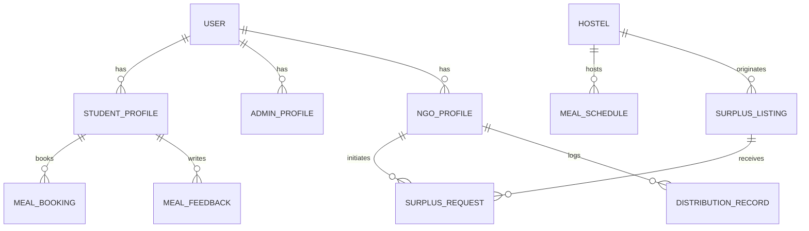

# 🛠️ Backend Requirements Specification — Messwise

> **Comprehensive backend implementation architecture, database schema, and service layout.**  
> Organized by functional domain to guide backend service construction in Python / FastAPI.

---

## 1. Authentication & Security

* **Mechanism:** JWT (JSON Web Tokens) with HMAC-SHA256 (`HS256`) or asymmetric `RS256`.
* **Password Storage:** Salted hashing with `bcrypt` / `argon2`.
* **Token Lifespan:** Access token (1 hour), Refresh token (7 days).
* **Role Verification:** Fast role-based dependency injection middleware (`get_current_user`, `require_role(["student", "admin", "ngo"])`).
* **CORS Policy:** Strict origin allowlist supporting local development and frontend portals.

---

## 2. Users & Roles

The system supports three distinct operational roles:

| Role | Identifier | Typical Operations |
|---|---|---|
| **Student** | `student` | View daily menu, opt-in/opt-out (RSVP) for meals, generate QR token, submit feedback, view eco-streak. |
| **Mess Admin** | `admin` | View attendance forecasts, log daily batch production/waste, publish surplus listings, verify OTP handovers. |
| **NGO Partner** | `ngo` | Browse surplus listings, claim donations with volunteer ETA, receive pickup OTP, log distribution proofs. |

---

## 3. Core Database Entities (Schema Model)

### Entity Definitions (SQLAlchemy / PostgreSQL)

1. **`User`**
   - `id`: UUID (PK)
   - `email`: String (Unique, Indexed)
   - `hashed_password`: String
   - `role`: Enum (`student`, `admin`, `ngo`)
   - `created_at`: DateTime
   - `is_active`: Boolean

2. **`StudentProfile`**
   - `id`: UUID (PK)
   - `user_id`: UUID (FK -> User)
   - `name`: String
   - `roll_no`: String (Unique)
   - `hostel_id`: UUID (FK -> Hostel)
   - `room_number`: String
   - `dietary_preference`: Enum (`Vegetarian`, `Non-Vegetarian`, `Vegan`, `Eggetarian`)
   - `total_meals_booked`: Integer (Default 0)
   - `total_meals_saved`: Integer (Default 0)
   - `co2_avoided_kg`: Float (Default 0.0)
   - `eco_points`: Integer (Default 0)

3. **`Hostel` / `Mess`**
   - `id`: UUID (PK)
   - `name`: String
   - `campus_block`: String
   - `enrolled_boarders`: Integer
   - `capacity`: Integer
   - `supervisor_id`: UUID (FK -> User)

4. **`MealSchedule` & `MenuCatalog`**
   - `id`: UUID (PK)
   - `hostel_id`: UUID (FK -> Hostel)
   - `date`: Date
   - `meal_session`: Enum (`breakfast`, `lunch`, `dinner`)
   - `menu_description`: Text
   - `start_time`: Time
   - `end_time`: Time
   - `cutoff_time`: Time (RSVP deadline)

5. **`MealBooking` (RSVP)**
   - `id`: UUID (PK)
   - `student_id`: UUID (FK -> StudentProfile)
   - `schedule_id`: UUID (FK -> MealSchedule)
   - `date`: Date
   - `meal_session`: Enum (`breakfast`, `lunch`, `dinner`)
   - `status`: Enum (`Booked`, `OptedOut`, `Served`, `Expired`)
   - `token_code`: String (e.g., `TK-LCH-419`)
   - `booked_at`: DateTime

6. **`MealFeedback`**
   - `id`: UUID (PK)
   - `student_id`: UUID (FK -> StudentProfile)
   - `schedule_id`: UUID (FK -> MealSchedule)
   - `rating`: Integer (1 to 5)
   - `comment`: Text
   - `submitted_at`: DateTime

7. **`DailyProductionLog`**
   - `id`: UUID (PK)
   - `hostel_id`: UUID (FK -> Hostel)
   - `date`: Date
   - `meal_session`: Enum (`breakfast`, `lunch`, `dinner`)
   - `prepared_qty`: Integer
   - `served_qty`: Integer
   - `surplus_qty`: Integer
   - `plate_waste_qty`: Integer
   - `logged_at`: DateTime

8. **`SurplusListing`**
   - `id`: UUID (PK)
   - `hostel_id`: UUID (FK -> Hostel)
   - `title`: String
   - `meals_count`: Integer
   - `location_detail`: String
   - `temp_celsius`: Integer
   - `storage_condition`: String
   - `food_type`: String
   - `dietary`: String
   - `pickup_deadline`: String / DateTime
   - `status`: Enum (`Published`, `Requested`, `ReadyForPickup`, `PickedUp`, `Expired`)
   - `pickup_otp`: String (4-digit hash)
   - `image_url`: String
   - `created_at`: DateTime

9. **`SurplusRequest`**
   - `id`: UUID (PK)
   - `surplus_id`: UUID (FK -> SurplusListing)
   - `ngo_id`: UUID (FK -> NgoProfile)
   - `volunteer_name`: String
   - `vehicle_info`: String
   - `eta`: String
   - `status`: Enum (`Pending`, `Approved`, `InTransit`, `Collected`, `Cancelled`)
   - `requested_at`: DateTime
   - `verified_at`: DateTime

10. **`DistributionRecord`**
    - `id`: UUID (PK)
    - `ngo_id`: UUID (FK -> NgoProfile)
    - `surplus_id`: UUID (FK -> SurplusListing, Nullable)
    - `food_title`: String
    - `beneficiaries_served`: Integer
    - `location`: String
    - `delivered_at`: DateTime
    - `proof_status`: Enum (`Verified`, `Pending`)
    - `co2_diverted_kg`: Float

---

## 4. CRUD & Business Operations

* **Student RSVP Workflow:**
  - Create / Toggle RSVP booking with automatic token generation.
  - Enforce meal cutoff deadlines (e.g. 2 hours prior to session start).
  - Increment student eco-points & avoided carbon footprint calculation ($0.3\text{ kg CO}_2$ per timely RSVP).
* **Production & Waste Logging:**
  - Record batch output and calculate differential surplus: $\text{Surplus} = \max(0, \text{Prepared} - \text{Served})$.
* **Surplus Redistribution Workflow:**
  - Mess Admin creates listing with FSSAI temperature checks ($\ge 60^\circ\text{C}$ for hot holding).
  - NGO submits 1-click claim request with vehicle and volunteer details.
  - Mess Admin approves $\rightarrow$ driver provides 4-digit OTP at counter $\rightarrow$ Admin verifies OTP to finalize handover.

---

## 5. Analytics & Aggregations

* **Ecosystem KPIs:**
  - Total meals rescued across campus.
  - Total active NGO beneficiaries nourished.
  - Total cumulative $\text{CO}_2$ emissions diverted (kg).
* **Hostel Operational Metrics:**
  - Daily prep-to-plate ratio ($\%$ accuracy).
  - Plate waste trend charts across days of the week.

---

## 6. Machine Learning / AI Forecasting

* **Service Module:** `services/forecast_service.py`
* **Input Features:**
  - `enrolled_boarders`: Total hostel population.
  - `active_rsvps`: Number of opted-in students for the meal session.
  - `day_of_week`: One-hot encoded (e.g., Friday dinners drop $-14\%$, Sunday lunch surges $+15\%$).
  - `academic_calendar`: Boolean toggles (`exam_season`, `holiday_weekend`, `cultural_fest`).
  - `weather_condition`: Rain ($+10\%$ indoor dining), extreme heat ($-6\%$).
  - `historical_attendance_ratio`: Rolling 30-day moving average turnout.
* **Output:**
  - `expected_demand`: Predicted actual attendees.
  - `recommended_cook`: $\text{expected\_demand} \times 1.026$ ($+2.6\%$ safe buffer margin).
  - `confidence_score`: Metric confidence ($0-100\%$).
  - `insights`: Auto-generated explanatory narrative bullets.

---

## 7. Notifications & Real-Time Sync

* **WebSocket Hub:** Broadcast events on `/api/v1/ws/live` to synchronize:
  - Immediate alert to NGOs upon new surplus food publication.
  - Immediate alert to Mess Supervisor when an NGO claims food.
  - Real-time update of live metrics across active browser sessions.

---

## 8. Reports & Data Export

* Daily mess audit reports (PDF / CSV summary of batch production, attendance error percentage, and food waste).
* NGO rescue tax and sustainability compliance log.
